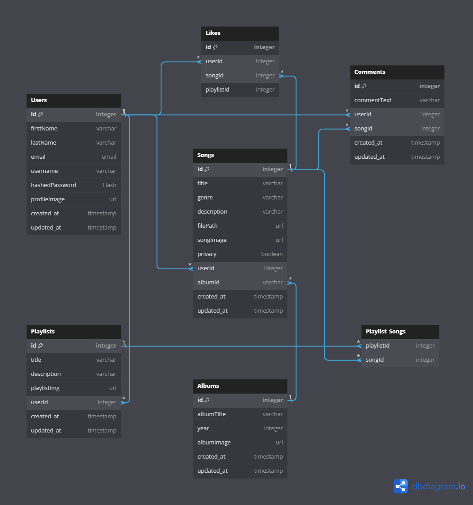

# `AudioSun`

AudioSun is a fullstack app that developed by Joel, Brenda, and Eddie that simulates the basic functionality of the music site - 'SxxxdCloud'. The app was devleoped using Flask as the backend, and React.js as the frontend. The use of Vue.js as the primary front-end tooling and build system.

## MVP - Feature & Implmentation

**Sign-up and Sign-in**
* The server allows the new user to sign up an account using the sign-up link in the Navigation bar when current session of the user is = 'null'. A popup modal is then shown when sign-up link is clicked. All info on the forms are required to be properly filled out in order to create a user, else the server will return errors from the Flask backend. The sign-up button is also grey out unless all info are filled out.

**Full CURD of Songs**
* Users should be able to view all songs regardless of the sign-in status.
* Users should be able to upload songs only when signed in.
* Users should be able to update their uploaded songs only when signed in.
* Users should be able to delete their uploaded songs only when signed in.

**Full CURD of Comment**
* Users should be able to view all comments on a song regardless of sign-in status.
* Users should be able to add a comment to a song only when signed in.
* Users should be able to update their comment on a song only when signed in.
* Users should be able to remove their comments from a song when signed in.

**Likes**
* Users should be able to view the likes on a song regarless of signed-in status.
* Users should be able to like a song only when signed in.
* Users should be able to unlike a song only when signed in.

**Playlists**
* Users should be able to view all of their playlists only when signed in.
* Users should be able to add a song to one of their playlists only when signed in.
* Users should be able to remove a song from a playlist only when signed in.

**WaveForms - to be implemented later**
* Users should be able to see the wave forms for a song.


**Search bar- to be implemented later**
* Users should be able to search for songs by artist or song name.
* Users should be able to view the results of their search.


## Database Schema




```
Table Users {
  id integer [primary key]
  firstName varchar
  lastName varchar
  email email
  username varchar
  hashedPassword Hash
  profileImage url
  created_at timestamp
  updated_at timestamp
}

Table Songs {
  id integer [primary key]
  title varchar
  genre varchar
  description varchar
  filePath url
  songImage url
  privacy boolean
  userId integer
  albumId varchar [null]
  created_at timestamp
  updated_at timestamp
}

Table Albums {
  id integer [primary key]
  albumTitle varchar
  year Integer
  albumImage url
  created_at timestamp
  updated_at timestamp
}


Table Likes {
  id integer [primary key]
  userId integer [null Foreign Key referencing Users.id]
  songId integer [null Foreign Key referencing Songs.id]
  playlistId integer [null Foreign Key referencing playlist.id]
}

Table Comments {
  id integer [primary key]
  commentText varchar
  userId integer [Foreign Key referencing Users.id]
  songId integer [Foreign Key referencing Songs.id]
  created_at timestamp
  updated_at timestamp
}

Table Playlists {
  id integer [primary key]
  title varchar
  userId integer [Foreign Key referencing Users.id]
  created_at timestamp
  updated_at timestamp
}

Table Playlist_Songs { [Many to Many between Playlists and Songs]
  playlistId integer [Foreign Key referencing Playlists.id]
  songId integer [Foreign Key referencing Songs.id]
}

```

## User stories
